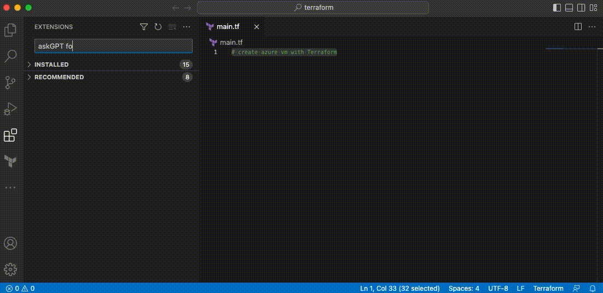
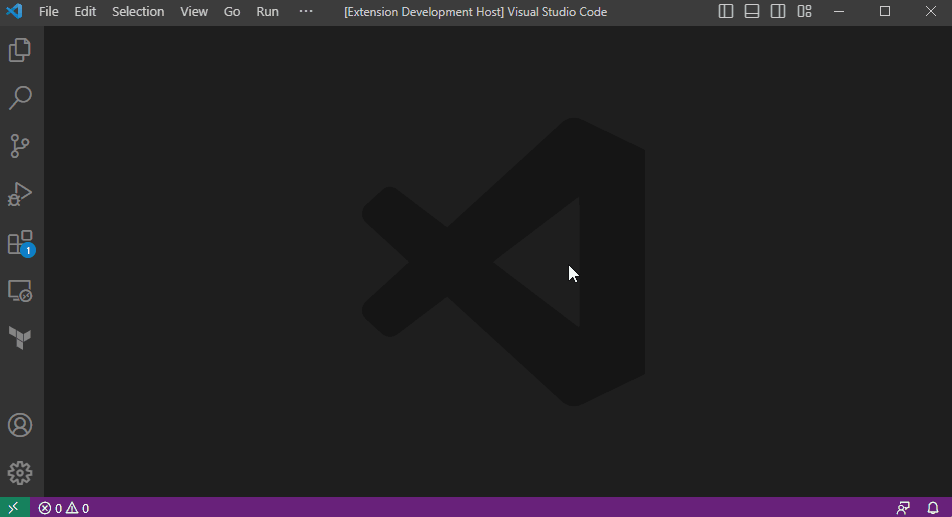
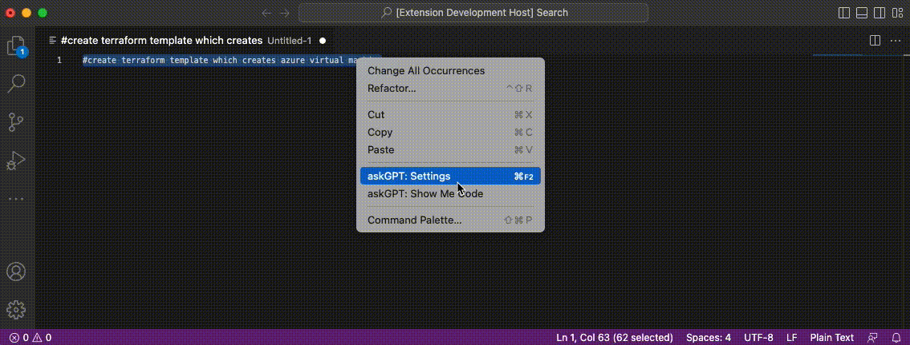
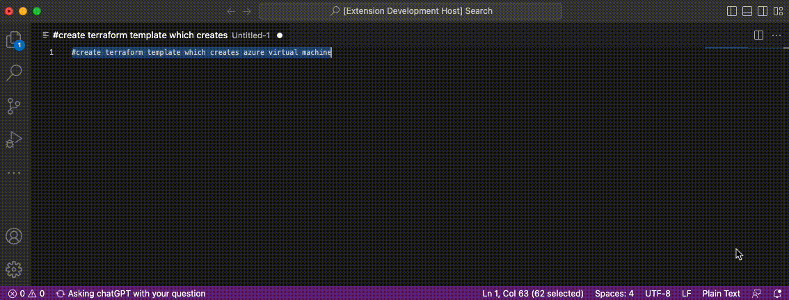

# askGPT extension for VSCode


<a href="https://www.buymeacoffee.com/hidetran"></a>

This extension use official OpenAI API and its documentation, go to https://cloudcli.io to get full documentations and instructions.
Make sure you have your OpenAI API key added at https://platform.openai.com/account/api-keys

## Usage
- Write a comment ask for something you need chatGPT build for (e.g //create Terraform template that create an Azure Virtual machine)
- Select that comment (highlight it in VSCode)
- Right click ⤍ AskGPT: Show me code
- Wait & enjoys 😎

## Hot Keys
To use keyboard, you must selected your text in the VSCode editor then press one of key combination bellow:
- ```Ctrl/Cmd + F2```...................Go to Settings
- ```Ctrl/Cmd + F3```...................English grammar check
- ```Ctrl/Cmd + F4```...................Explain code block
- ```Ctrl/Cmd + Enter```............Search for code by chatGPT
- ```Ctrl/Cmd + Shift + F```...Refactor code

## Installation
Open your VSCode ⤍ Extensions and search for ```AskGPT for VSCode``` then ```Install```.


Press ```cmd + shift + p``` and type ```askGPT> Set API Key``` to open to setup OpenAI API key.


Write your code request under a comment, then ```Right Click + Action```


Wait until result appears


It took few seconds to get code suggested then your comment will be replaced by code.