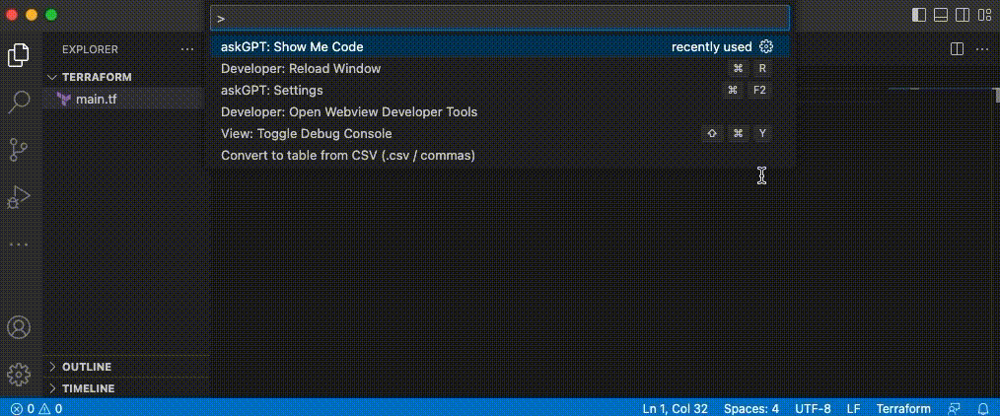

# askGPT extension for VSCode


This extension use official OpenAI API and its documentation, go to https://cloudcli.io to get full documentations and instructions.
Make sure you have your OpenAI API key added at https://platform.openai.com/account/api-keys

## Usage
- Write a comment ask for something you need chatGPT build for (e.g //create Terraform template that create an Azure Virtual machine)
- Select that comment (highlight it in VSCode)
- Right click ⤍ AskGPT: Show me code
- Wait & enjoys 😎

## Installation
Open your VSCode ⤍ Extensions and search for ```AskGPT for VSCode``` then ```Install```.


Press ```cmd + shift + p``` and type ```askGPT: Settings``` to open Settings page then enter OpenAI API key.



It took few seconds to get code suggested then your comment will be replaced by code.